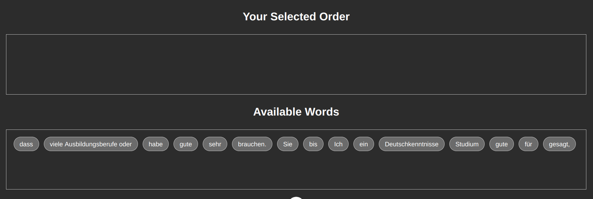
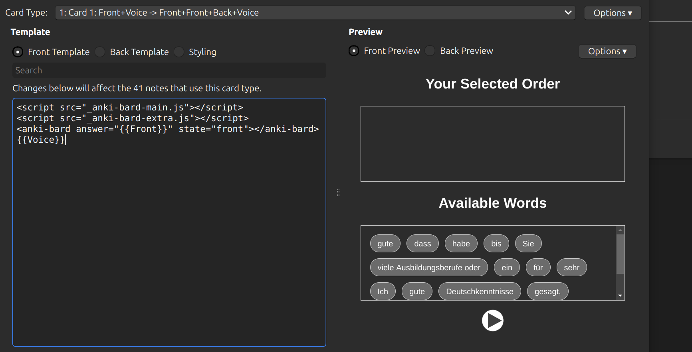
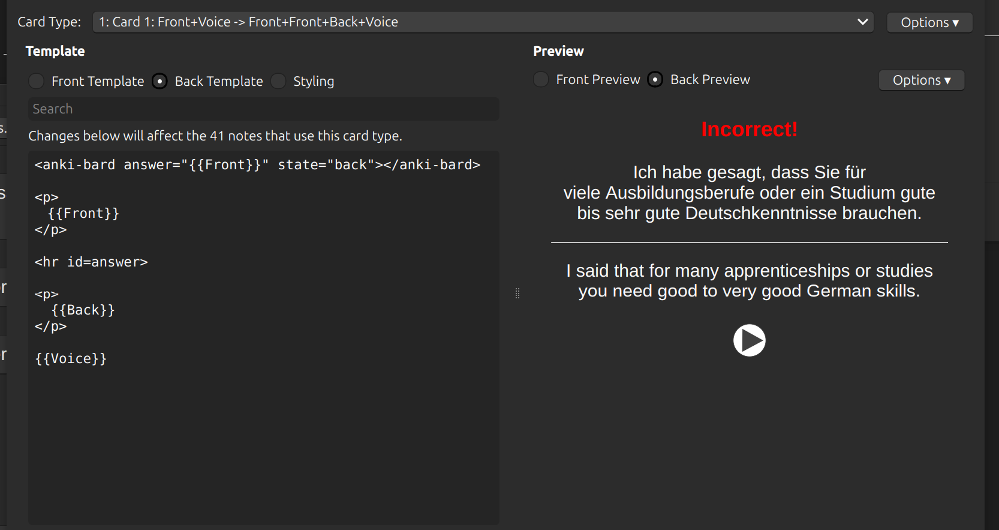

# Anki Bard
This project helps enhance the Anki flashcards with adding the scrambling feature

## Example
Suppose that you want to make a flashcard from a German sentence and you aim at learning this sentence and its ordering.
"Du musst hier bleiben"
This project can create a randomise ordered version of this sentence and asks the user to reorder the sentence untill it is the correct version
"musst", "hier", "Du", "bleiben"

## Image of an example flashcard



In the flashcard the user clicks on each word to make a complete sentence in  the upper box

## How to build

```bash
yarn run build
```
move the output *.js files into the media folder of Anki. This location varies based on the OS. In Ubuntu you can locate this folder in ~/.local/share/Anki2/[yourProfileName]/collection.media. You must copy the js files here and rename them to have a underline prefix.
For me it is:
_anki-bard-extra.js
_anki-bard-main.js

Then you must change the template of your Notes. Here is an example:



